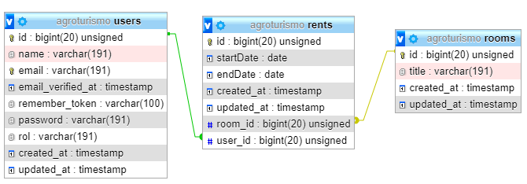

# PROYECTO AGROTURISMO CREADO CON PHP+LARAVEL+MYSQL :computer:

API REST creada en backend con PHP, Laravel y MySQL para nutrir a una website de agroturismo "Varitx Paradise", destinada a hacer reservas para pasar vacaciones en una finca de agroturismo situada en el norte de Mallorca. 

***

## DESCRIPCIÓN :open_book:

Hay dos roles en la API: cliente y administrador.

Como *cliente* puedes registrarte, hacer login, solicitar, ver y eliminar reservas.

Como *administrador*, puedes ver las reservas de todos los usuarios.

***

## TECNOLOGÍAS :gear:

:large_blue_circle: PHP 8.

:large_blue_circle: Laravel 6.

:large_blue_circle: PHP MyAdmin.

:large_blue_circle: Composer.

:large_blue_circle: Passport.

:large_blue_circle: GIT.

:large_blue_circle: Git Flow.

:large_blue_circle: Postman.

:large_blue_circle: Eloquent.

***

## ENDPOINTS :link:

### Clientes: :bust_in_silhouette: 

:round_pushpin: POST localhost:8000/api/register (añade un nuevo usuario).

:round_pushpin: POST localhost:8000/api/login (el usuario introduce su email y la contraseña para entrar).

:round_pushpin: GET localhost:8000/api/logout (el usuario sale de su cuenta).

***

### Reservas: :date:

:round_pushpin: POST localhost:8000/api/rent (añade una nueva reserva).

:round_pushpin: DELETE localhost:8000/api/rent/cancel/{id} (cancela la reserva de un usuario).

:round_pushpin: GET localhost:8000/api/rent/show/{id} (el usuario puede ver sus reservas).

***

## POSTMAN ENDPOINTS :round_pushpin:

Puedes acceder a las colecciones de postman de este proyecto a través de la ruta **public/agroturismo.postman_collection.json**

## DIAGRAMA TABLAS PHP MYADMIN :bulb:

## Enlace a Heroku del frontend de REACT :link:

https://varitxparadise.herokuapp.com/

## Instalacion :hammer_and_wrench:

:gear: $ git clone https://github.com/lubersol/agroturismo-PHP.git

:gear: $ cd ../path/to/the/file

:gear: $ composer update

:gear: $ php artisan migrate

:gear: $ php artisan passport:install

:gear: $ php artisan serve